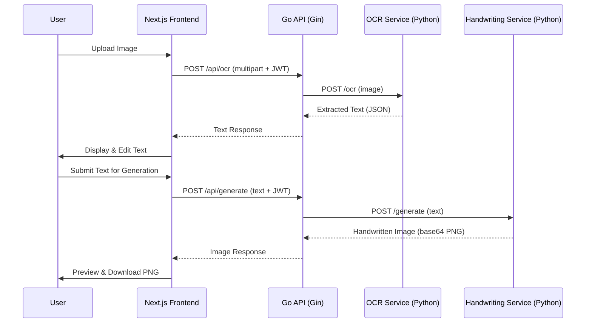

<div align="center">

# ✍️ Paperly

**AI-Powered Document Transformation Platform**

*Image → Text → Handwritten Notes — All in One Place*

[](https://nextjs.org/)
[](https://react.dev/)
[](https://go.dev/)
[](https://python.org/)
[](https://tailwindcss.com/)
[](LICENSE)

**`Version 0.2.0 · Beta`**

[🚀 Live Demo](https://frontend-ten-iota-59.vercel.app/) · [Features](#3-feature-inventory) · [Architecture](#5-system-architecture) · [Getting Started](#10-getting-started) · [API Reference](#7-api-reference) · [Roadmap](#9-roadmap)

</div>

---

## 📄 Product Requirements Document (PRD)

### 1. Product Overview

**Paperly** is a full-stack SaaS web application designed to help **students, educators, and professionals** transform documents with AI. It provides two core capabilities:

| Capability | Description |
|---|---|
| **Image → Text (OCR)** | Upload any image (photo, scan, screenshot) and extract clean, editable text using AI-powered OCR |
| **Text → Handwriting** | Convert typed or extracted text into realistic handwritten-style notes, exportable as JPG/PDF |

**Target Users:** Students who need to convert messy notes into clean digital content, generate aesthetic handwritten assignments, or digitize printed/handwritten material quickly.

---

### 2. Current Beta UI

Below are screenshots of the current beta version of Paperly:

<table>
  <tr>
    <td align="center" width="50%"><b>🔐 Login Page</b></td>
    <td align="center" width="50%"><b>📝 Sign Up Page</b></td>
  </tr>
  <tr>
    <td>Glassmorphic card with email/password fields, "Forgot Password" link, and Google OAuth button. Dark ambient background with animated glowing orbs.</td>
    <td>Full registration form with Full Name, Email, Password, and Confirm Password fields. Same premium glassmorphic design language.</td>
  </tr>
</table>

<table>
  <tr>
    <td align="center" width="50%"><b>🏠 Landing Page (Bottom Section)</b></td>
    <td align="center" width="50%"><b>📊 Dashboard / Workspace</b></td>
  </tr>
  <tr>
    <td>Three-step flow (Upload → Process → Download), stats section (15M+ docs, 500K+ users), feature tabs for AI Transcription & Handwritten Generation, CTA, and full footer.</td>
    <td>Three-panel workspace layout: Left sidebar for Handwritten Notes (folders, recent notes, tags), center canvas for document editing, and right sidebar for OCR & Processing (upload dropzone, progress bar, Extract Text button).</td>
  </tr>
</table>

---

### 3. Feature Inventory

| # | Feature | Status | Description |
|---|---------|--------|-------------|
| F1 | 📤 Image Upload | ✅ Implemented | Drag-and-drop + click-to-browse image upload supporting PNG, JPG, WEBP up to 10 MB. Includes image preview with remove button. |
| F2 | 🔍 OCR Text Extraction | ✅ Implemented | Server-side OCR via Go backend → Python OCR microservice (Tesseract). Extracts text from uploaded images with confidence scoring. |
| F3 | ✏️ Text Editor | ✅ Implemented | Editable textarea for reviewing and modifying extracted OCR text before handwriting generation. Supports copy-to-clipboard. |
| F4 | 📝 Handwriting Generation | ✅ Implemented | Server-side handwriting generation via Go backend → Python handwriting microservice (Pillow). Renders text on ruled-paper with handwriting-style fonts. Client-side canvas fallback also available. |
| F5 | 📥 PNG Export / Download | ✅ Implemented | Download button for generated handwriting images (exports as PNG). |
| F6 | 🏠 Landing Page | ✅ Implemented | Full marketing page with Hero (parallax + word-by-word stagger animations), Stats, How-It-Works, Features, CTA, and Footer sections. |
| F7 | 🔐 User Authentication | ✅ Implemented | Real JWT-based authentication with bcrypt password hashing via Go backend. Signup, login, and protected routes fully functional. |
| F8 | 🔑 Google OAuth | ⬜ Planned | "Sign in with Google" button present in UI but not functional. |
| F9 | 📚 Multi-page PDF Export | ⬜ Planned | Not yet implemented. |
| F10 | 💎 Premium Plans / Subscriptions | ⬜ Planned | Not yet implemented. |
| F11 | ☁️ Cloud Storage | ⬜ Planned | Not yet implemented. |
| F12 | 🧠 AI Note Summarization | ⬜ Planned | Not yet implemented. |
| F13 | 🗂️ Flashcard Generation | ⬜ Planned | Not yet implemented. |
| F14 | 🗺️ Mindmap Generation | ⬜ Planned | Not yet implemented. |

> **Legend:** ✅ Implemented · ⬜ Planned

---

### 4. User Flows

#### Flow 1: OCR (Image → Text)
```
User lands on "/" → Clicks "Start Using Paperly" → Signs up on "/signup"
→ Redirected to "/dashboard" → Selects "OCR Tool" tab
→ Drops image in upload zone → Clicks "Extract Text"
→ Image sent to Go backend → Proxied to Python OCR service (Tesseract)
→ Extracted text returned → User reviews/edits → Copies text to clipboard
```

#### Flow 2: Handwriting Generation (Text → Image)
```
User on "/dashboard" → Selects "Handwriting" tab
→ Types or pastes text in textarea → Clicks "Generate Handwritten Image"
→ Text sent to Go backend → Proxied to Python handwriting service (Pillow)
→ Handwriting image rendered on ruled paper → Returned as base64 PNG
→ User previews image → Clicks "Download" to save as PNG
```

#### Flow 3: Authentication
```
New user: "/" → "/signup" → POST /api/auth/signup → JWT token stored → "/dashboard"
Returning user: "/" → "/login" → POST /api/auth/login → JWT token stored → "/dashboard"
Session restore: Page load → GET /api/auth/me with stored JWT → User validated
Protected route: Unauthenticated access to "/dashboard" → Auto-redirect to "/login"
Logout: Click "Logout" → JWT cleared from localStorage → Redirect to "/"
```

---

### 5. System Architecture

```
paperly/
├── frontend/                    # Next.js 16 (React 19 + Tailwind v4 + shadcn/ui)
│   └── src/
│       ├── app/                 # App Router pages (/, /login, /signup, /dashboard)
│       ├── components/          # UI components
│       │   ├── landing/         # Landing page sections (hero, stats, how-it-works, etc.)
│       │   ├── ui/              # shadcn/ui primitives (button, card, input, etc.)
│       │   ├── upload.tsx       # Drag-and-drop image uploader
│       │   ├── ocr-result.tsx   # OCR extraction display
│       │   ├── ocr-sidebar.tsx  # OCR processing sidebar with server-side extraction
│       │   ├── handwriting-generator.tsx  # Text → Handwriting tool
│       │   ├── feature-tabs.tsx # OCR/Handwriting tab switcher
│       │   ├── navbar.tsx       # Public navbar
│       │   └── dashboard-navbar.tsx  # Authenticated navbar
│       ├── contexts/            # React contexts (auth, theme)
│       └── lib/
│           ├── utils.ts         # General utilities
│           └── api.ts           # Centralized API client (JWT, typed endpoints)
│
├── backend/                     # Go (Gin + GORM + JWT)
│   ├── main.go                  # Entry point — router, DB, middleware, routes
│   ├── go.mod / go.sum          # Go module dependencies
│   ├── .env                     # Environment configuration
│   ├── config/
│   │   └── config.go            # Environment variable loader
│   ├── models/
│   │   ├── user.go              # User model (id, name, email, bcrypt password)
│   │   └── note.go              # Note model (for saved documents)
│   ├── handlers/
│   │   ├── auth.go              # POST /api/auth/signup, /login, GET /api/auth/me
│   │   ├── ocr.go               # POST /api/ocr → proxy to Python OCR service
│   │   ├── handwriting.go       # POST /api/generate → proxy to Python HW service
│   │   └── health.go            # GET /api/health
│   ├── middleware/
│   │   ├── auth.go              # JWT Bearer token validation
│   │   └── cors.go              # CORS configuration
│   └── utils/
│       └── jwt.go               # JWT token generation & validation
│
├── ocr-service/                 # Python OCR Microservice (FastAPI + Tesseract)
│   ├── app.py                   # FastAPI app with POST /ocr endpoint
│   └── requirements.txt         # Python dependencies
│
├── handwriting-service/         # Python Handwriting Microservice (FastAPI + Pillow)
│   ├── app.py                   # FastAPI app with POST /generate endpoint
│   └── requirements.txt         # Python dependencies
│
└── readme.md
```

### Tech Stack

| Layer | Technology | Version | Purpose |
|-------|-----------|---------|---------|
| **Frontend** | Next.js (App Router) | 16.1.6 | Routing, SSR, pages |
| | React | 19.2.3 | UI rendering |
| | Tailwind CSS | v4 | Styling |
| | shadcn/ui + Radix UI | latest | Component primitives |
| | Framer Motion | 12.35+ | Animations & transitions |
| | Lenis | 1.3+ | Smooth scrolling |
| | Lucide React | latest | Icons |
| **Backend** | Go (Gin) | 1.26 | REST API, orchestration |
| | GORM | 1.25 | Database ORM (SQLite) |
| | golang-jwt | 5.2 | JWT authentication |
| | bcrypt | — | Password hashing |
| **OCR Service** | Python + FastAPI | 3.13 | OCR microservice |
| | Tesseract (pytesseract) | 0.3.13 | Text extraction engine |
| | Pillow | 11.0 | Image processing |
| **Handwriting Service** | Python + FastAPI | 3.13 | Handwriting microservice |
| | Pillow | 11.0 | Image rendering |
| **Database** | SQLite (dev) | — | Local development database |

### Data Flow



---

### 6. Frontend Routes

| Route | Page | Auth Required | Description |
|-------|------|:---:|-------------|
| `/` | Landing Page | ❌ | Marketing page with hero, stats, how-it-works, features, CTA, footer |
| `/login` | Login | ❌ | Glassmorphic login form with email/password + Google OAuth |
| `/signup` | Sign Up | ❌ | Registration form with full name, email, password, confirm password |
| `/dashboard` | Workspace | ✅ | Protected core app — OCR tool + Handwriting generator with tabbed UI |

---

### 7. API Reference

#### Backend REST API (Go + Gin)

| Method | Endpoint | Auth | Status | Description |
|--------|----------|:----:|:------:|-------------|
| `GET` | `/api/health` | ❌ | ✅ | Health check — returns `{"status":"ok","version":"1.0.0"}` |
| `POST` | `/api/auth/signup` | ❌ | ✅ | User registration — accepts `{name, email, password}`, returns `{token, user}` |
| `POST` | `/api/auth/login` | ❌ | ✅ | User login — accepts `{email, password}`, returns `{token, user}` |
| `GET` | `/api/auth/me` | ✅ | ✅ | Get authenticated user profile — requires `Authorization: Bearer <token>` |
| `POST` | `/api/ocr` | ✅ | ✅ | Upload image → extract text via OCR service — accepts `multipart/form-data` |
| `POST` | `/api/generate` | ✅ | ✅ | Submit text → generate handwritten image — accepts `{text}`, returns `{image}` |
| `POST` | `/api/auth/google` | ❌ | ⬜ | Google OAuth callback (planned) |

#### Python Microservice Endpoints

| Method | Endpoint | Service | Port | Status | Description |
|--------|----------|---------|:----:|:------:|-------------|
| `GET` | `/health` | ocr-service | 5001 | ✅ | Health check |
| `POST` | `/ocr` | ocr-service | 5001 | ✅ | Extract text from uploaded image (Tesseract) |
| `GET` | `/health` | handwriting-service | 5002 | ✅ | Health check |
| `POST` | `/generate` | handwriting-service | 5002 | ✅ | Generate handwriting image from text (Pillow) |

---

### 8. Known Gaps & Technical Debt (Beta)

| Area | Gap | Priority |
|------|-----|:--------:|
| **Google OAuth** | Button exists in UI but has no functionality. | 🟡 Medium |
| **PDF Export** | Not implemented. Only PNG download is available. | 🟡 Medium |
| **Database** | Using SQLite for local dev. Need PostgreSQL for production. | 🟡 Medium |
| **Tesseract** | Requires system-level installation. Graceful fallback if not installed. | 🟡 Medium |
| **Error Handling** | Minimal error states in frontend. No global error boundary. | 🟢 Low |
| **Testing** | No frontend or backend tests. | 🟢 Low |
| **Rate Limiting** | No API rate limiting on auth or OCR endpoints. | 🟢 Low |

---

### 9. Roadmap

#### Phase 1 — MVP Completion ✅
- [x] Landing page with dark mode UI (Hero, Stats, How-It-Works, Features, CTA, Footer)
- [x] Login & Signup pages with glassmorphic dark theme
- [x] Dashboard with tabbed OCR & Handwriting tools
- [x] Image upload with drag-and-drop
- [x] Go backend with Gin, GORM, JWT auth
- [x] OCR microservice (Python + FastAPI + Tesseract)
- [x] Handwriting microservice (Python + FastAPI + Pillow)
- [x] Real JWT authentication with bcrypt password hashing
- [x] Frontend connected to real backend API
- [x] PNG export for handwriting output

#### Phase 2 — Enhanced Features
- [ ] Google OAuth integration
- [ ] Multi-page PDF export
- [ ] PostgreSQL for production database
- [ ] Cloud storage for user documents (AWS S3)
- [ ] User profile & settings page
- [ ] Document history & saved notes

#### Phase 3 — AI Expansion
- [ ] AI note summarization
- [ ] Flashcard generation from notes
- [ ] Mindmap generation
- [ ] Multiple handwriting style options
- [ ] Batch processing (multiple images)

#### Phase 4 — Scale & Monetize
- [ ] Subscription model (free tier / premium)
- [ ] Dedicated GPU workers for AI services
- [ ] Rate limiting & usage quotas
- [ ] Admin analytics dashboard
- [ ] Microservices containerization (Docker/K8s)
- [ ] AWS deployment (ECS Fargate / Lambda)

---

### 10. Getting Started

#### Prerequisites

| Tool | Version | Required For |
|------|---------|-------------|
| **Node.js** | 18+ | Frontend (Next.js) |
| **Go** | 1.22+ | Backend API |
| **Python** | 3.9+ | OCR & Handwriting microservices |
| **Tesseract OCR** | 5.x | OCR text extraction (optional — graceful fallback) |

<details>
<summary><b>🔧 Installing Tesseract OCR (optional)</b></summary>

**Windows:**
```bash
# Option 1: Chocolatey
choco install tesseract

# Option 2: Download installer from
# https://github.com/UB-Mannheim/tesseract/wiki
```

**macOS:**
```bash
brew install tesseract
```

**Ubuntu/Debian:**
```bash
sudo apt install tesseract-ocr
```

> **Note:** The OCR service works without Tesseract installed — it returns a helpful placeholder message telling you how to install it.
</details>

#### Installation

```bash
git clone https://github.com/rookiecoder910/paperly.git
cd paperly
```

---

#### 🚀 Running the Full Application

You need **4 terminals** to run all services simultaneously:

##### Terminal 1 — Go Backend API

```bash
cd backend

# First-time setup only:
go mod tidy

# Start the server:
go run main.go
```
> 🌐 **API available at http://localhost:8081**

The backend will:
- Auto-create the SQLite database (`paperly.db`)
- Auto-migrate all models (users, notes)
- Register all API routes under `/api`

##### Terminal 2 — Python OCR Service

```bash
cd ocr-service

# First-time setup only:
pip install -r requirements.txt

# Start the service:
python app.py
```
> 🌐 **OCR service available at http://localhost:5001**

##### Terminal 3 — Python Handwriting Service

```bash
cd handwriting-service

# First-time setup only:
pip install -r requirements.txt

# Start the service:
python app.py
```
> 🌐 **Handwriting service available at http://localhost:5002**

##### Terminal 4 — Next.js Frontend

```bash
cd frontend

# First-time setup only:
npm install

# Start the dev server:
npm run dev
```
> 🌐 **Frontend available at http://localhost:3000**

---

#### ✅ Verifying Everything Works

Once all 4 services are running, verify the stack:

```bash
# 1. Health check (Go backend)
curl http://localhost:8081/api/health
# → {"service":"paperly-api","status":"ok","version":"1.0.0"}

# 2. Health check (OCR service)
curl http://localhost:5001/health
# → {"service":"ocr-service","status":"ok","tesseract_available":true}

# 3. Health check (Handwriting service)
curl http://localhost:5002/health
# → {"service":"handwriting-service","status":"ok"}

# 4. Open the frontend
# → http://localhost:3000
```

Then try the full flow:
1. Open http://localhost:3000
2. Click **"Start Using Paperly"** → Sign up with any email/password
3. You'll be redirected to the **Dashboard** with your name displayed
4. Upload an image → Click **"Extract Text"** → See OCR results
5. Type text → Click **"Generate Handwritten Image"** → Download PNG

---

#### ⚙️ Environment Configuration

The Go backend uses a `.env` file for configuration. Copy the example and customize:

```bash
cd backend
cp .env.example .env
```

| Variable | Default | Description |
|----------|---------|-------------|
| `PORT` | `8081` | Go backend server port |
| `JWT_SECRET` | `paperly-super-secret-...` | JWT signing secret (⚠️ change in production!) |
| `DB_PATH` | `paperly.db` | SQLite database file path |
| `OCR_SERVICE_URL` | `http://localhost:5001` | Python OCR service URL |
| `HANDWRITING_SERVICE_URL` | `http://localhost:5002` | Python handwriting service URL |
| `FRONTEND_URL` | `http://localhost:3000` | Frontend URL (for CORS) |

The frontend API URL is configured in `frontend/src/lib/api.ts` or via the `NEXT_PUBLIC_API_URL` environment variable.

---

### 11. Project Structure Summary

| Directory | Files | Status |
|-----------|:-----:|:------:|
| `frontend/src/app/` | 7 files (4 pages + layout + globals + favicon) | ✅ Active |
| `frontend/src/components/` | 11 component files | ✅ Active |
| `frontend/src/components/landing/` | 6 landing page sections | ✅ Active |
| `frontend/src/components/ui/` | 6 shadcn primitives | ✅ Active |
| `frontend/src/contexts/` | 2 context files (auth, theme) | ✅ Active |
| `frontend/src/lib/` | 2 utility files (utils, api) | ✅ Active |
| `backend/` | 10 Go files + config | ✅ Active |
| `ocr-service/` | 2 files (app + requirements) | ✅ Active |
| `handwriting-service/` | 2 files (app + requirements) | ✅ Active |

---

## 👨‍💻 Author

**Manas Kumar**

Built as a scalable full-stack SaaS project with production-ready microservices architecture.

## 📜 License

This project is proprietary software under development for educational and commercial SaaS experimentation purposes.

---

<div align="center">

**[⬆ Back to Top](#️-paperly)**

Made with ❤️ by Manas Kumar

</div>
