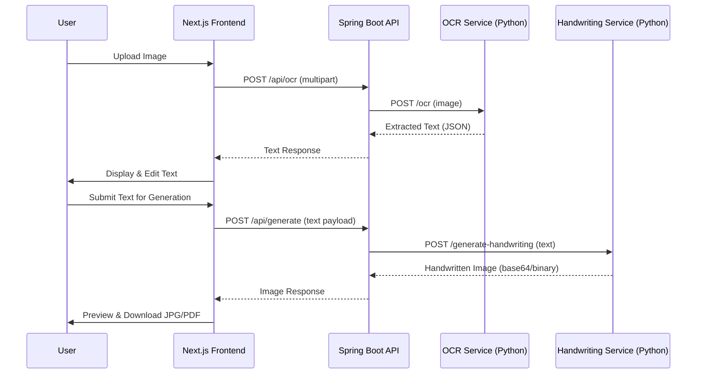

<div align="center">

# ✍️ Paperly

**AI-Powered Document Transformation Platform**

*Image → Text → Handwritten Notes — All in One Place*

[](https://nextjs.org/)
[](https://react.dev/)
[](https://spring.io/projects/spring-boot)
[](https://python.org/)
[](https://tailwindcss.com/)
[](LICENSE)

**`Version 0.1.0 · Beta`**

[🚀 Live Demo](https://frontend-ten-iota-59.vercel.app/) · [Features](#-features) · [Architecture](#-system-architecture) · [Getting Started](#-getting-started) · [API Reference](#-api-reference) · [Roadmap](#-roadmap)

</div>

---

## 📄 Product Requirements Document (PRD)

### 1. Product Overview

**Paperly** is a full-stack SaaS web application designed to help **students, educators, and professionals** transform documents with AI. It provides two core capabilities:

| Capability | Description |
|---|---|
| **Image → Text (OCR)** | Upload any image (photo, scan, screenshot) and extract clean, editable text using AI-powered OCR |
| **Text → Handwriting** | Convert typed or extracted text into realistic handwritten-style notes, exportable as JPG/PDF |

**Target Users:** Students who need to convert messy notes into clean digital content, generate aesthetic handwritten assignments, or digitize printed/handwritten material quickly.

---

### 2. Current Beta UI

Below are screenshots of the current beta version of Paperly:

<table>
  <tr>
    <td align="center" width="50%"><b>🔐 Login Page</b></td>
    <td align="center" width="50%"><b>📝 Sign Up Page</b></td>
  </tr>
  <tr>
    <td>Glassmorphic card with email/password fields, "Forgot Password" link, and Google OAuth button. Dark ambient background with animated glowing orbs.</td>
    <td>Full registration form with Full Name, Email, Password, and Confirm Password fields. Same premium glassmorphic design language.</td>
  </tr>
</table>

<table>
  <tr>
    <td align="center" width="50%"><b>🏠 Landing Page (Bottom Section)</b></td>
    <td align="center" width="50%"><b>📊 Dashboard / Workspace</b></td>
  </tr>
  <tr>
    <td>Three-step flow (Upload → Process → Download), stats section (15M+ docs, 500K+ users), feature tabs for AI Transcription & Handwritten Generation, CTA, and full footer.</td>
    <td>Three-panel workspace layout: Left sidebar for Handwritten Notes (folders, recent notes, tags), center canvas for document editing, and right sidebar for OCR & Processing (upload dropzone, progress bar, Extract Text button).</td>
  </tr>
</table>

---

### 3. Feature Inventory

| # | Feature | Status | Description |
|---|---------|--------|-------------|
| F1 | 📤 Image Upload | ✅ Implemented | Drag-and-drop + click-to-browse image upload supporting PNG, JPG, WEBP up to 10 MB. Includes image preview with remove button. |
| F2 | 🔍 OCR Text Extraction | 🟡 Mock | UI complete with Extract Text button, loading spinner, and extracted text display in editable textarea. Currently returns mock placeholder text. |
| F3 | ✏️ Text Editor | ✅ Implemented | Editable textarea for reviewing and modifying extracted OCR text before handwriting generation. Supports copy-to-clipboard. |
| F4 | 📝 Handwriting Generation | 🟡 Mock | Full UI with text input, Generate button, and image preview. Currently generates a placeholder SVG with ruled-paper styling. |
| F5 | 📥 JPG Export / Download | ✅ Implemented | Download button for generated handwriting images (currently exports SVG). |
| F6 | 🏠 Landing Page | ✅ Implemented | Full marketing page with Hero (parallax + word-by-word stagger animations), Stats, How-It-Works, Features, CTA, and Footer sections. |
| F7 | 🔐 User Authentication | 🟡 Mock | Login and Signup pages with full UI. Auth is mocked via `localStorage` — not yet connected to Spring Boot backend. |
| F8 | 🔑 Google OAuth | ⬜ Planned | "Sign in with Google" button present in UI but not functional. |
| F9 | 📚 Multi-page PDF Export | ⬜ Planned | Not yet implemented. |
| F10 | 💎 Premium Plans / Subscriptions | ⬜ Planned | Not yet implemented. |
| F11 | ☁️ Cloud Storage | ⬜ Planned | Not yet implemented. |
| F12 | 🧠 AI Note Summarization | ⬜ Planned | Not yet implemented. |
| F13 | 🗂️ Flashcard Generation | ⬜ Planned | Not yet implemented. |
| F14 | 🗺️ Mindmap Generation | ⬜ Planned | Not yet implemented. |

> **Legend:** ✅ Implemented · 🟡 UI Complete / Mock Backend · ⬜ Planned

---

### 4. User Flows

#### Flow 1: OCR (Image → Text)
```
User lands on "/" → Clicks "Start Using Paperly" → Signs up on "/signup"
→ Redirected to "/dashboard" → Selects "OCR Tool" tab
→ Drops image in upload zone → Clicks "Extract Text"
→ Reviews/edits extracted text in textarea → Copies text to clipboard
```

#### Flow 2: Handwriting Generation (Text → Image)
```
User on "/dashboard" → Selects "Handwriting" tab
→ Types or pastes text in textarea → Clicks "Generate Handwritten Image"
→ Previews generated handwriting image → Clicks "Download" to save as JPG/SVG
```

#### Flow 3: Authentication
```
New user: "/" → "/signup" → Fills form → Redirected to "/dashboard"
Returning user: "/" → "/login" → Enters credentials → Redirected to "/dashboard"
Protected route: Unauthenticated access to "/dashboard" → Auto-redirect to "/login"
```

---

### 5. System Architecture

```
paperly/
├── frontend/                # Next.js 16 (React 19 + Tailwind v4 + shadcn/ui)
│   └── src/
│       ├── app/             # App Router pages (/, /login, /signup, /dashboard)
│       ├── components/      # UI components (30 files)
│       │   ├── landing/     # Landing page sections (hero, stats, how-it-works, features, cta, footer)
│       │   ├── ui/          # shadcn/ui primitives (button, card, input, label, tabs, textarea)
│       │   ├── upload.tsx          # Drag-and-drop image uploader
│       │   ├── ocr-result.tsx      # OCR extraction display
│       │   ├── handwriting-generator.tsx  # Text → Handwriting tool
│       │   ├── feature-tabs.tsx    # OCR/Handwriting tab switcher
│       │   ├── navbar.tsx          # Public navbar
│       │   └── dashboard-navbar.tsx # Authenticated navbar
│       ├── contexts/        # React contexts (auth, theme)
│       └── lib/             # Utilities
├── backend/                 # Spring Boot 4.x (Java 17)
│   └── src/main/
│       ├── java/.../controller/UserController.java  # Skeleton REST controller
│       └── resources/application.properties
├── ocr-service/             # Python AI microservice (planned, currently empty)
├── handwriting-service/     # Python AI microservice (planned, currently empty)
└── readme.md
```

### Tech Stack

| Layer | Technology | Version | Purpose |
|-------|-----------|---------|---------|
| **Frontend** | Next.js (App Router) | 16.1.6 | Routing, SSR, pages |
| | React | 19.2.3 | UI rendering |
| | Tailwind CSS | v4 | Styling |
| | shadcn/ui + Radix UI | latest | Component primitives |
| | Framer Motion | 12.35+ | Animations & transitions |
| | Lenis | 1.3+ | Smooth scrolling |
| | Lucide React | latest | Icons |
| **Backend** | Spring Boot | 4.0.3 | REST API, orchestration |
| | Spring Security | included | Authentication (planned) |
| | Spring Data JPA | included | Database ORM |
| | PostgreSQL | latest | Database |
| | Lombok | latest | Boilerplate reduction |
| **AI Services** | Python + FastAPI/Flask | 3.x | OCR & handwriting (planned) |

### Data Flow



---

### 6. Frontend Routes

| Route | Page | Auth Required | Description |
|-------|------|:---:|-------------|
| `/` | Landing Page | ❌ | Marketing page with hero, stats, how-it-works, features, CTA, footer |
| `/login` | Login | ❌ | Glassmorphic login form with email/password + Google OAuth |
| `/signup` | Sign Up | ❌ | Registration form with full name, email, password, confirm password |
| `/dashboard` | Workspace | ✅ | Protected core app — OCR tool + Handwriting generator with tabbed UI |

---

### 7. API Reference

#### Backend REST API (Spring Boot)

| Method | Endpoint | Status | Description |
|--------|----------|:------:|-------------|
| `GET` | `/api/health` | ⬜ | Health check |
| `POST` | `/api/ocr` | ⬜ | Upload image → extract text via OCR service |
| `POST` | `/api/generate` | ⬜ | Submit text → generate handwritten image |
| `POST` | `/api/auth/signup` | ⬜ | User registration |
| `POST` | `/api/auth/login` | ⬜ | User login (JWT/session) |
| `POST` | `/api/auth/google` | ⬜ | Google OAuth callback |
| `GET` | `/api/users/me` | ⬜ | Get authenticated user profile |

#### AI Microservice Endpoints (Python)

| Method | Endpoint | Service | Description |
|--------|----------|---------|-------------|
| `POST` | `/ocr` | ocr-service | Extract text from uploaded image |
| `POST` | `/generate-handwriting` | handwriting-service | Convert text to handwritten image |

> **Note:** All backend and AI service endpoints are currently **planned but not implemented**. The backend has only a skeleton `UserController` class with no methods.

---

### 8. Known Gaps & Technical Debt (Beta)

| Area | Gap | Priority |
|------|-----|:--------:|
| **Authentication** | Currently mocked via `localStorage`. No JWT, no session management, no password hashing. | 🔴 High |
| **OCR Pipeline** | Returns hardcoded mock text. `ocr-service/` directory is empty. | 🔴 High |
| **Handwriting Gen** | Returns placeholder SVG. `handwriting-service/` directory is empty. | 🔴 High |
| **Backend API** | `UserController` is an empty skeleton. No endpoints implemented. No DB connection configured. | 🔴 High |
| **Google OAuth** | Button exists in UI but has no functionality. | 🟡 Medium |
| **PDF Export** | Not implemented. Only SVG download is available. | 🟡 Medium |
| **Database** | PostgreSQL driver included in `pom.xml` but `application.properties` has no DB config. | 🟡 Medium |
| **Error Handling** | Minimal error states in frontend. No global error boundary. | 🟢 Low |
| **Testing** | No frontend tests. Backend test dependencies exist but no test files. | 🟢 Low |

---

### 9. Roadmap

#### Phase 1 — MVP Completion (Current Priority)
- [x] Landing page with dark mode UI (Hero, Stats, How-It-Works, Features, CTA, Footer)
- [x] Login & Signup pages with glassmorphic dark theme
- [x] Dashboard with tabbed OCR & Handwriting tools
- [x] Image upload with drag-and-drop
- [ ] Connect OCR service (Python) to Spring Boot backend
- [ ] Connect Handwriting service (Python) to Spring Boot backend
- [ ] Implement real user authentication with Spring Security + JWT
- [ ] Configure PostgreSQL database connection
- [ ] JPG export for handwriting output

#### Phase 2 — Enhanced Features
- [ ] Google OAuth integration
- [ ] Multi-page PDF export
- [ ] Cloud storage for user documents
- [ ] User profile & settings page
- [ ] Document history & saved notes

#### Phase 3 — AI Expansion
- [ ] AI note summarization
- [ ] Flashcard generation from notes
- [ ] Mindmap generation
- [ ] Multiple handwriting style options
- [ ] Batch processing (multiple images)

#### Phase 4 — Scale & Monetize
- [ ] Subscription model (free tier / premium)
- [ ] Dedicated GPU workers for AI services
- [ ] Rate limiting & usage quotas
- [ ] Admin analytics dashboard
- [ ] Microservices containerization (Docker/K8s)

---

### 10. Getting Started

#### Prerequisites

- **Node.js** 18+ and npm
- **Java** 17+ and Maven
- **Python** 3.9+

#### Installation

```bash
git clone https://github.com/rookiecoder910/paperly.git
cd paperly
```

##### 1. Frontend

```bash
cd frontend
npm install
npm run dev
```
> 🌐 Available at **http://localhost:3000**

##### 2. Backend

**Windows:**
```bash
cd backend
mvnw.cmd spring-boot:run
```

**macOS/Linux:**
```bash
cd backend
./mvnw spring-boot:run
```
> 🌐 Available at **http://localhost:8080**

##### 3. AI Services (when implemented)

```bash
cd ocr-service
pip install -r requirements.txt
python app.py
# 🌐 Available at http://localhost:5001

cd ../handwriting-service
pip install -r requirements.txt
python app.py
# 🌐 Available at http://localhost:5002
```

---

### 11. Project Structure Summary

| Directory | Files | Status |
|-----------|:-----:|:------:|
| `frontend/src/app/` | 7 files (4 pages + layout + globals + favicon) | ✅ Active |
| `frontend/src/components/` | 19 component files | ✅ Active |
| `frontend/src/components/ui/` | 6 shadcn primitives | ✅ Active |
| `frontend/src/contexts/` | 2 context files (auth, theme) | ✅ Active |
| `frontend/src/lib/` | 1 utility file | ✅ Active |
| `backend/src/main/` | 2 Java files + 1 properties file | 🟡 Skeleton |
| `ocr-service/` | 0 files | ⬜ Empty |
| `handwriting-service/` | 0 files | ⬜ Empty |

---

## 👨‍💻 Author

**Manas Kumar**

Built as a scalable full-stack SaaS project with production-ready architecture.

## 📜 License

This project is proprietary software under development for educational and commercial SaaS experimentation purposes.

---

<div align="center">

**[⬆ Back to Top](#️-paperly)**

Made with ❤️ by Manas Kumar

</div>
