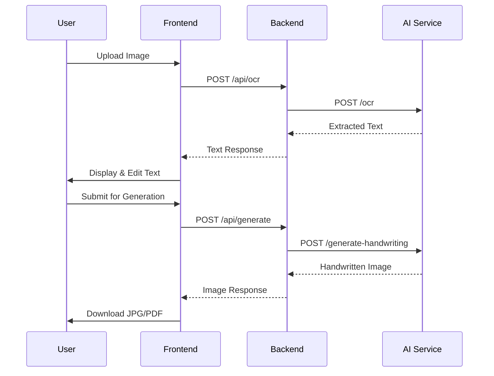

<div align="center">

# ✍️ Paperly

**AI-Powered Image to Handwritten Notes Converter**

[](https://nextjs.org/)
[](https://spring.io/projects/spring-boot)
[](https://python.org/)
[](LICENSE)

[Features](#-features) • [Architecture](#-architecture) • [Getting Started](#-getting-started) • [API Reference](#-api-reference) • [Roadmap](#-roadmap)

---

*Transform uploaded images into clean digital text and generate realistic handwritten-style notes with AI.*

</div>

---

## 📖 Overview

Paperly is a full-stack web application designed to help students and educators convert messy notes into clean digital content and generate aesthetic handwritten assignments. Built with a scalable microservices architecture using **Next.js**, **Spring Boot**, and **Python AI services**.

---

## ✨ Features

| Feature | Status |
|---------|--------|
| 📤 Image Upload (JPG/PNG) | ✅ Available |
| 🔍 OCR Text Extraction | ✅ Available |
| ✏️ Text Editor | ✅ Available |
| 📝 Handwritten Note Generation | ✅ Available |
| 📄 JPG Export | ✅ Available |
| 📚 Multi-page PDF Export | 🚧 Coming Soon |
| 🔐 Authentication & User Accounts | 🚧 Coming Soon |
| 💎 Premium Plans | 🚧 Coming Soon |

---

## 🏗 Architecture

```
paperly/
├── frontend/           # Next.js (React + Tailwind + shadcn/ui)
├── backend/            # Spring Boot REST API (Orchestrator)
├── ai-service/         # Python AI Service
│   ├── ocr/            # Image → Text extraction
│   └── handwriting/    # Text → Handwritten image generation
└── README.md
```

### System Components

| Layer | Technology | Responsibility |
|-------|------------|----------------|
| **Frontend** | Next.js 15, React, Tailwind CSS, shadcn/ui | User interface, image uploads, text display, preview rendering |
| **Backend** | Spring Boot 3.x, Java | API Gateway, request validation, service orchestration, auth (future) |
| **AI Service** | Python, FastAPI/Flask | OCR processing, handwriting generation |

### Data Flow



---

## 🚀 Getting Started

### Prerequisites

- **Node.js** 18+ and npm
- **Java** 17+ and Maven
- **Python** 3.9+

### Installation

Clone the repository:

```bash
git clone https://github.com/yourusername/paperly.git
cd paperly
```

### 1. Frontend

```bash
cd frontend
npm install
npm run dev
```

> 🌐 Available at **http://localhost:3000**

### 2. Backend

**Windows:**
```bash
cd backend
mvnw.cmd spring-boot:run
```

**macOS/Linux:**
```bash
cd backend
./mvnw spring-boot:run
```

> 🌐 Available at **http://localhost:8080**

### 3. AI Service

```bash
cd ai-service
pip install -r requirements.txt
python app.py
```

> 🌐 Available at **http://localhost:5000**

---

## 🔌 API Reference

### Backend Endpoints

| Method | Endpoint | Description |
|--------|----------|-------------|
| `GET` | `/api/health` | Health check |
| `POST` | `/api/ocr` | Upload image and extract text |
| `POST` | `/api/generate` | Generate handwritten note image |

### AI Service Endpoints

| Method | Endpoint | Description |
|--------|----------|-------------|
| `POST` | `/ocr` | Extract text from image |
| `POST` | `/generate-handwriting` | Convert text to handwritten image |

---

## 🎯 Vision

Paperly aims to become a **student-focused productivity platform** that:

- 📝 Converts messy notes into clean digital content
- ✨ Generates aesthetic handwritten assignments
- ⏱️ Saves time for students and educators
- 🚀 Scales to support millions of users

---

## 🗺 Roadmap

### Phase 1 - MVP (Current)
- [x] Core OCR functionality
- [x] Handwriting generation
- [x] Basic UI/UX
- [ ] JPG export

### Phase 2 - Enhanced Features
- [ ] Multi-page PDF export
- [ ] User authentication
- [ ] Cloud storage integration

### Phase 3 - AI Expansion
- [ ] AI note summarization
- [ ] Flashcard generation
- [ ] Mindmap generation

### Phase 4 - Scale & Monetize
- [ ] Subscription model
- [ ] Dedicated GPU workers
- [ ] Microservices split (OCR & Handwriting)

---

## 📊 Project Status

<div align="center">

**🚧 MVP in Active Development**

`Version 0.1.0`

</div>

---

## 👨‍💻 Author

**Manas Kumar**

Built as a scalable full-stack SaaS project with production-ready architecture.

---

## 📜 License

This project is proprietary software under development for educational and commercial SaaS experimentation purposes.

---

<div align="center">

**[⬆ Back to Top](#️-paperly)**

Made with ❤️ by Manas Kumar

</div>
